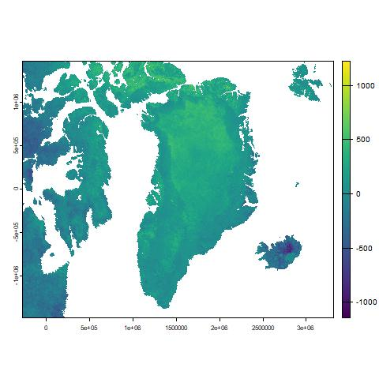

# Reporting multitemporal analysis in R

First of all, we should import an image by:

``` r
im.list() # make a list
gr = im.import("greenland") # to import the image
```

Then, we might calculate the difference of values of two images

``` r
grdif = gr[[4]] - gr[[1]]
```

This will create the following output image:



> Note 1: If you want to put pdf files you can rely on: https://stackoverflow.com/questions/39777166/display-pdf-image-in-markdown

> Note 2: Infrormation abou the Copernicus program can be found at: https://www.copernicus.eu/it
